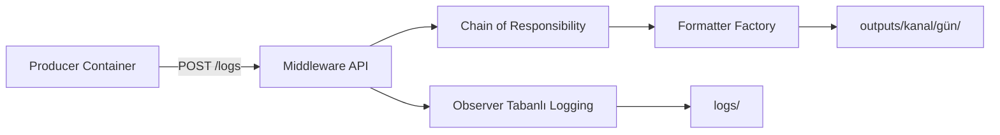

# Middleware Veri İşleme Platformu

Sahte veri üreten bir producer servisinden gelen log kayıtlarını FastAPI tabanlı middleware üzerinden işleyen; KVKK maskelemesi uygulayan, kategorilendiren ve çoklu formatta çıktı üreten bir veri işleme sistemi.

## İçindekiler

1. [Proje Amacı](#proje-amacı)
2. [Sistem Mimarisi](#sistem-mimarisi)
3. [Teknoloji Yığını](#teknoloji-yığını)
4. [Tasarım Kalıpları](#tasarım-kalıpları)
5. [Dosya Yapısı](#dosya-yapısı)
6. [Kurulum](#kurulum)
7. [Kullanım](#kullanım)
8. [Docker](#docker)
9. [Veri Akışı Örneği](#veri-akışı-örneği)
10. [Testler](#testler)
11. [Stres Testi](#stres-testi)
12. [Modül Açıklamaları](#modül-açıklamaları)
13. [Çıktı Formatları](#çıktı-formatları)
14. [Notlar](#notlar)

---

## Proje Amacı

Üniversite final projesi kapsamında geliştirilmiş bir middleware sistemidir. Temel görevleri:

- Sahte log/veri kayıtları üretme (Producer)
- Gelen verileri sırayla işleme (Chain of Responsibility)
- Gürültü sayılan düşük seviyeli logları filtreleme
- KVKK maskelemesi uygulama
- Veriyi kategorilendirme ve zenginleştirme
- Çoklu formatta çıktı üretimi (JSON, CSV, HTML)
- Merkezi logging sistemi (Observer Pattern)
- Stres testi ile performans ölçümü

---

## Sistem Mimarisi



Middleware'e ulaşan her kayıt şu adımlardan geçer:

| # | Adım | İş |
| --- | --- | --- |
| 1 | `prune` | `trace_id`, `span_id`, `debug` gibi gürültü alanlarını atar |
| 2 | `log_filter` | Eşiğin altındaki kayıtları düşürür (varsayılan: `DEBUG` ve `INFO`) |
| 3 | `kvkk_mask` | Kişisel verileri maskeler |
| 4 | `enrichment` | Kategori ve işlenme zamanı ekler |
| 5 | `routing` | Kategoriye göre kanal belirler |

Zincirden geçen kayıt üç formatta da yazılır; kanal, çıktının hangi klasöre gideceğini belirler.

---

## Teknoloji Yığını

| Bileşen | Teknoloji | Versiyon |
| --- | --- | --- |
| Framework | FastAPI | 0.115.0 |
| Server | Uvicorn | 0.30.6 |
| Veri üretimi | Faker | 26.1.0 |
| HTTP istemci | requests | 2.32.3 |
| Test | pytest | 8.3.3 |
| Container | Docker | - |
| Dil | Python | 3.11+ |

---

## Tasarım Kalıpları

### 1. Chain of Responsibility

**Dosya:** `middleware/pipeline.py`

İşleme adımlarını sırayla zincirler. Her adım kaydı bir sonrakine iletir; `None` dönen bir adım zinciri kısa devre eder ve kaydı düşürür.

```python
pipeline = build_chain([
    ("prune", prune_step),
    ("log_filter", log_filter_step),
    ("kvkk_mask", kvkk_mask_step),
    ("enrichment", enrichment_step),
    ("routing", routing_step),
])
```

Bir adım kaydı düşürdüğünde hangi adımın düşürdüğü `context["dropped_by"]` içine yazılır ve API bunu yanıtta bildirir.

### 2. Factory Pattern

**Dosya:** `middleware/formatters.py`

Formatlayıcı seçimini merkezileştirir. Format adı verildiğinde doğru sınıf üretilir.

```python
FormatterFactory().create("json")   # JsonFormatter
FormatterFactory().create("csv")    # CsvFormatter
FormatterFactory().create("html")   # HtmlFormatter
```

### 3. Observer Pattern

**Dosya:** `middleware/observers.py`

Middleware olaylarını dinleyip farklı hedeflere yazar. Her olayda tüm observer'lar bilgilendirilir.

```python
dispatcher = EventDispatcher([NormalLogObserver(), CriticalLogObserver()])
```

Yayınlanan olay türleri: `received`, `processed`, `dropped`, `error`.

---

## Dosya Yapısı

```text
middleware_project/
├── producer/
│   ├── Dockerfile
│   └── main.py                 # Faker ile sahte veri üretimi
│
├── middleware/
│   ├── main.py                 # FastAPI uygulaması, POST /logs
│   ├── pipeline.py             # Chain of Responsibility akışı
│   ├── steps.py                # İşleme adımları
│   ├── formatters.py           # Factory Pattern formatlayıcılar
│   ├── observers.py            # Observer Pattern logging
│   ├── logger.py               # Merkezi logging yapılandırması
│   └── storage.py              # Kanal/gün bazlı dosya yazma
│
├── tests/
│   ├── test_pipeline.py        # Chain of Responsibility
│   ├── test_formatters.py      # Factory + HTML kaçışı
│   ├── test_observers.py       # Observer + log yolu
│   ├── test_steps.py           # Filtre, maskeleme, zenginleştirme
│   ├── test_storage.py         # Çıktı yerleşimi ve yazma bütünlüğü
│   └── test_api.py             # /logs uçtan uca
│
├── logs/                       # Çalışma zamanı log dosyaları
├── outputs/                    # İşlenmiş veri çıktıları
│
├── stress_test.py              # Performans ölçüm betiği
├── requirements.txt            # Çalışma bağımlılıkları
├── requirements-dev.txt        # Test bağımlılıkları
├── Dockerfile
├── docker-compose.yml
├── PROJECT_SPEC.md
└── README.md
```

---

## Kurulum

### Ön Koşullar

- Python 3.11 veya sonrası
- pip paket yöneticisi

### Adım 1: Bağımlılıkları yükleyin

```bash
python -m pip install -r requirements.txt
```

### Adım 2: Middleware servisini başlatın

```bash
python -m uvicorn middleware.main:app --host 0.0.0.0 --port 8000
```

Başarılı başlangıç çıktısı:

```text
INFO:     Uvicorn running on http://0.0.0.0:8000
```

### Adım 3: Producer'ı çalıştırın (yeni terminal)

```bash
python producer/main.py
```

Varsayılan olarak 5 kayıt üretip middleware'e gönderir.

---

## Kullanım

### Ortam Değişkenleri

**Producer:**

| Değişken | Varsayılan | Açıklama |
| --- | --- | --- |
| `MIDDLEWARE_URL` | `http://localhost:8000/logs` | Hedef endpoint |
| `PRODUCER_COUNT` | `5` | Üretilecek kayıt sayısı |
| `PRODUCER_DELAY` | `0.5` | Kayıtlar arası gecikme (saniye) |

**Middleware:**

| Değişken | Varsayılan | Açıklama |
| --- | --- | --- |
| `LOG_LEVEL_THRESHOLD` | `WARNING` | Bu seviyenin altındaki kayıtlar düşürülür |

Örnek:

```bash
PRODUCER_COUNT=100 PRODUCER_DELAY=0.1 python producer/main.py
```

Yalnızca `ERROR` ve `CRITICAL` işlensin isterseniz middleware'i şöyle başlatın:

```bash
LOG_LEVEL_THRESHOLD=ERROR python -m uvicorn middleware.main:app --port 8000
```

### API

#### POST /logs

**İstek:**

```bash
curl -X POST http://localhost:8000/logs \
  -H "Content-Type: application/json" \
  -d '{
    "timestamp": "2026-08-21T18:00:00Z",
    "level": "ERROR",
    "event_type": "login_failed",
    "role": "cybersec",
    "message": "Basarisiz giris denemesi",
    "user_name": "Ahmet Yilmaz",
    "email": "ahmet@example.com",
    "phone": "5551234567",
    "ip": "192.168.1.1"
  }'
```

**Yanıtlar:**

| Durum | HTTP | Gövde |
| --- | --- | --- |
| İşlendi | 200 | `{"status": "ok", "channel": "critical", "formats": ["json", "html", "csv"], "role": "cybersec"}` |
| Filtrede düşürüldü | 200 | `{"status": "dropped", "reason": "log_filter"}` |
| Geçersiz gövde | 422 | FastAPI doğrulama hatası |
| İşleme hatası | 500 | `{"status": "error", "error": "OSError"}` |

---

## Docker

İki servisi birlikte başlatın:

```bash
docker compose up --build -d
```

Producer konteyneri `PRODUCER_COUNT` kadar kayıt gönderir ve işi bitince kapanır. Middleware çalışmaya devam eder.

Filtre eşiği `docker-compose.yml` içinde `LOG_LEVEL_THRESHOLD` ile ayarlanır.

---

## Veri Akışı Örneği

### 1. Gelen veri

```json
{
  "timestamp": "2026-08-21T18:00:00Z",
  "level": "ERROR",
  "event_type": "login_failed",
  "role": "cybersec",
  "message": "Basarisiz giris: ahmet@example.com hesabi kilitlendi",
  "user_name": "Ahmet Yilmaz",
  "email": "ahmet@example.com",
  "phone": "5551234567",
  "ip": "192.168.1.1",
  "tc": "12345678901",
  "trace_id": "abc-123"
}
```

### 2. Prune

`trace_id` gürültü alanı olarak atılır.

### 3. Log Filter

Seviye `ERROR`, eşik `WARNING` olduğu için kayıt geçer. Aynı kayıt `INFO` seviyesinde gelseydi düşürülürdü.

### 4. KVKK Maskelemesi

```json
{
  "message": "Basarisiz giris: a****@example.com hesabi kilitlendi",
  "user_name": "A***********",
  "email": "a****@example.com",
  "phone": "********67",
  "ip": "192.168.***.***",
  "tc": "*******8901"
}
```

`message` alanına dikkat: e-posta serbest metnin içine gömülü olmasına rağmen maskelendi. Maskeleme iki aşamalıdır — önce bilinen alan adları (Türkçe karşılıkları dahil), sonra tüm metin değerleri üzerinde regex taraması.

### 5. Enrichment

```json
{
  "category": "security",
  "processed_at": "2026-08-21T11:37:44.270436+00:00"
}
```

Kategori kuralları:

| Koşul | Kategori |
| --- | --- |
| `event_type` içinde `login_failed`, veya seviye `ERROR`/`CRITICAL` | `security` |
| `event_type` içinde `payment` | `finance` |
| Diğer | `general` |

### 6. Routing

| Kategori | Kanal |
| --- | --- |
| `security` | `critical` |
| `finance`, `general` | `general` |

### 7. Çıktı

Kayıt `cybersec` rolünden geldiği için JSON, HTML, CSV sırasıyla yazılır:

```text
outputs/critical/2026-08-21/data_<uuid>.json
outputs/critical/2026-08-21/data_<uuid>.html
outputs/critical/2026-08-21/data_<uuid>.csv
```

---

## Testler

Test bağımlılıklarını kurun ve testleri çalıştırın:

```bash
python -m pip install -r requirements-dev.txt
python -m pytest
```

Testler üç tasarım desenini, filtreleme eşiğini, KVKK maskelemesini, çıktı yerleşimini ve `/logs` endpoint'ini kapsar. Geçici dizin kullandıkları için `logs/` ve `outputs/` klasörlerine yazmazlar.

---

## Stres Testi

Middleware performansını ölçmek için:

```bash
python stress_test.py
```

Varsayılan yük 100, 1.000 ve 5.000 istektir; istekler 32 iş parçacığıyla eşzamanlı gönderilir. Ölçüm yalnızca istek/yanıt döngüsünü kapsar, sahte veri üretimi ölçümün dışındadır.

### Örnek çıktı

```text
Stress Test Results
----------------------------------------------------------------------
Requests: 1000 | Start: 14:33:32 | End: 14:33:36
Duration: 3.54s | Req/s: 282.24 | Processed: 1000 | Dropped: 0 | Errors: 0
----------------------------------------------------------------------
Note: each processed record writes 3 files -> ~3000 files under outputs/<channel>/<date>/
```

`Processed` ve `Dropped` ayrı raporlanır; böylece filtre eşiği değiştiğinde kaç kaydın gerçekten işlendiği rakamlardan görülür. Yukarıdaki ölçüm tek uvicorn işlemiyle, yerel diske yazarak alınmıştır.

### Özel test yükü

```python
from stress_test import run_tests

run_tests(counts=[200, 2000])
```

---

## Modül Açıklamaları

### `producer/main.py`

- Faker ile sahte veri üretir, HTTP POST ile middleware'e gönderir.
- Altı senaryoluk bir katalog döngüsel olarak üretilir: `login_success`, `logout_success`, `payment_processed`, `profile_update`, `login_failed`, `critical_alert`.
- Bağlantı hatalarında yeniden dener (konteyner henüz ayakta olmayabilir); sunucunun reddettiği kayıtları tekrar göndermez.

### `middleware/main.py`

- FastAPI uygulaması, `POST /logs` endpoint'i.
- Pipeline, formatter ve observer entegrasyonu.
- İşleme sırasında oluşan hataları yakalar, `CRITICAL` olay olarak yayınlar ve HTTP 500 döner.

### `middleware/pipeline.py`

- Chain of Responsibility deseni.
- `Step` sınıfı ile adım zincirlemesi, `build_chain()` yardımcı fonksiyonu.

### `middleware/steps.py`

| Fonksiyon | İş |
| --- | --- |
| `prune_step` | Gürültü alanlarını atar |
| `log_filter_step` | Eşiğin altındaki seviyeleri düşürür |
| `kvkk_mask_step` | Alan adı ve içerik taramasıyla kişisel verileri maskeler |
| `enrichment_step` | Kategori ve `processed_at` ekler |
| `routing_step` | Kategoriye göre kanal belirler |

### `middleware/formatters.py`

- `JsonFormatter`, `CsvFormatter`, `HtmlFormatter` ve `FormatterFactory`.
- `HtmlFormatter` anahtar ve değerleri kaçırır; log içeriği çıktı dosyasına işaretleme enjekte edemez.

### `middleware/observers.py`

- `NormalLogObserver`: tüm olayları `logs/middleware.log` dosyasına yazar.
- `CriticalLogObserver`: yalnızca `ERROR`/`CRITICAL` olayları `logs/critical.log` dosyasına yazar.

### `middleware/logger.py`

- Merkezi logging yapılandırması, `get_logger()` fonksiyonu.
- Dosya adı temizlenir, böylece log yolu `logs/` klasörünün dışına çıkamaz.

### `middleware/storage.py`

- Çıktıları `outputs/<kanal>/<gün>/` altına yazar.
- Dosya adları UUID tabanlıdır; yazma işlemi kilit ile korunur.
- Bir dosya zaten varsa aynı isteğin diğer dosyaları geri alınır, yarım çıktı kalmaz.

---

## Çıktı Formatları

Kabul edilen her kayıt üç formatta da yazılır. Formatların yazılma sırası role göre değişir:

| Rol | Sıra |
| --- | --- |
| `system_admin` | HTML, CSV, JSON |
| `cybersec` | JSON, HTML, CSV |
| `web_dev` | CSV, HTML, JSON |
| Tanımsız / bilinmeyen | HTML, CSV, JSON |

### JSON

```json
{
  "timestamp": "2026-08-21T18:00:00Z",
  "level": "ERROR",
  "event_type": "login_failed",
  "role": "cybersec",
  "message": "Basarisiz giris: a****@example.com hesabi kilitlendi",
  "user_name": "A***********",
  "email": "a****@example.com",
  "phone": "********67",
  "ip": "192.168.***.***",
  "tc": "*******8901",
  "category": "security",
  "processed_at": "2026-08-21T11:37:44.270436+00:00"
}
```

### CSV

```csv
timestamp,level,event_type,role,message,user_name,email,phone,ip,tc,category,processed_at
2026-08-21T18:00:00Z,ERROR,login_failed,cybersec,Basarisiz giris: a****@example.com hesabi kilitlendi,A***********,a****@example.com,********67,192.168.***.***,*******8901,security,2026-08-21T11:37:44.270436+00:00
```

### HTML

```html
<table>
  <tr><td>timestamp</td><td>2026-08-21T18:00:00Z</td></tr>
  <tr><td>level</td><td>ERROR</td></tr>
  <tr><td>message</td><td>Basarisiz giris: a****@example.com hesabi kilitlendi</td></tr>
  <tr><td>user_name</td><td>A***********</td></tr>
  <tr><td>category</td><td>security</td></tr>
</table>
```

---

## Notlar

- `logs/` ve `outputs/` klasörleri ihtiyaç halinde otomatik oluşturulur.
- Kanal/gün klasörlemesi çıktıyı dağıtır ancak tek bir klasörü tamamen sınırlamaz: aynı gün 5.000 istekli stres testi çalıştırılırsa `outputs/critical/<gün>/` altında on binden fazla dosya oluşabilir. Ölçüm sonrası bu klasörü temizlemek iyi olur.
- Filtrede düşürülen kayıtlar `outputs/` altına yazılmaz; servis `{"status": "dropped"}` döner.
- İşleme sırasında beklenmedik bir hata olursa kayıt sessizce kaybolmaz: olay `CRITICAL` seviyesinde loglanır ve servis HTTP 500 döner. Hata ayrıntısı yanıta konmaz, çünkü exception mesajı kaydın maskelenmemiş verisini taşıyabilir.
- Endpoint eşzamanlı istekleri FastAPI'nin iş parçacığı havuzunda karşılar; dosya yazma işlemi kilit ile korunur.
