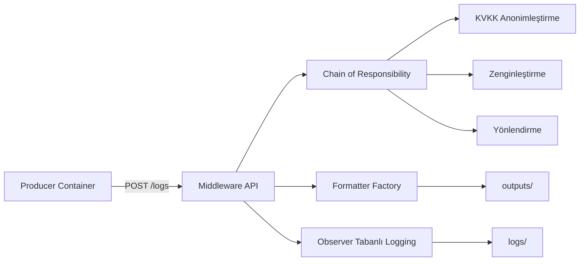

# Middleware Veri İşleme Platformu

Bu proje, iki konteynerden oluşan bir log işleme altyapısını gösterir. Bir konteyner sahte operasyon kayıtları üretir, diğer konteyner ise bu kayıtları karşılayıp KVKK uyumlu şekilde anonimleştirir, zenginleştirir ve çoklu formatlarda çıktı üretir.

## Proje Amacı

Sistem, üretici servis tarafından gönderilen kayıtları middleware katmanında işler. İşlenen kayıtlar `outputs/` klasörüne HTML, CSV ve JSON olarak yazılır. Uygulama olayları ayrıca observer tabanlı bir logging yapısı ile `logs/` içine alınır.

## Mimari Akış



## Özellikler

- Gerçekçi alanlar içeren sahte log üretimi.
- E-posta, telefon, IP, TC/TCKN ve kart numarası gibi hassas verilerin maskelenmesi.
- Kayıtların kategori ve işlenme zamanı ile zenginleştirilmesi.
- System admin, cybersec ve web dev rolleri için farklı çıktı sıralarıyla HTML, CSV ve JSON üretimi.
- Producer, tüm senaryoları sistematik olarak kapsamak için tanımlı senaryo kataloğunu döngüsel biçimde üretir.
- Performans doğrulaması için stres testi desteği.

## Kullanılan Tasarım Desenleri

- Chain of Responsibility: Kayıtları adım adım işlemek için.
- Factory Pattern: Formatlayıcı seçimini merkezi olarak yönetmek için.
- Observer Pattern: Middleware olaylarını kaydetmek ve kritik olayları izlemek için.

## Proje Yapısı

```text
middleware_project/
├── docker-compose.yml
├── Dockerfile
├── producer/
│   ├── Dockerfile
│   └── main.py
├── middleware/
│   ├── main.py
│   ├── pipeline.py
│   ├── steps.py
│   ├── formatters.py
│   ├── observers.py
│   ├── logger.py
│   └── storage.py
├── stress_test.py
├── requirements.txt
├── logs/
└── outputs/
```

## Yerel Çalıştırma

Bağımlılıkları kurun:

```bash
python -m pip install -r requirements.txt
```

Middleware servisini başlatın:

```bash
python -m uvicorn middleware.main:app --host 0.0.0.0 --port 8000
```

Producer servisini yerelde çalıştırın:

```bash
python producer/main.py
```

Stres testini çalıştırın:

```bash
python stress_test.py
```

## Docker ile Çalıştırma

İki servisi birlikte başlatın:

```bash
docker compose up --build -d
```

Producer konteyneri belirlenen sayıda kayıt gönderir ve işlem tamamlandığında kapanır.

## Çıktı Sırası

Kabul edilen her kayıt şu sırayla dosyalanır:

```text
HTML
CSV
JSON
```

## Notlar

- `logs/` ve `outputs/` klasörleri ihtiyaç halinde otomatik oluşturulur.
- Projede toplu istek performansını ölçmek için basit bir stres testi betiği bulunur.
