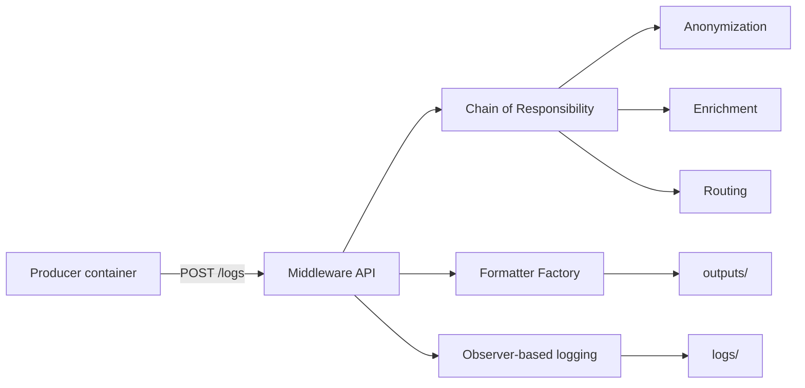

# Middleware Data Processing Platform

This project demonstrates a two-container log processing pipeline for a brokerage-style environment.
One container generates synthetic operational logs, and the other container acts as a middleware service that
anonymizes sensitive fields, enriches each record, and writes the result in multiple output formats.

## Overview

The middleware receives log events through a FastAPI endpoint and processes them through a small pipeline.
Processed records are written to `outputs/` as HTML, CSV, and JSON files.
Application events are also written to `logs/` through an observer-based logging layer.

## Architecture



## Features

- Synthetic log generation with realistic fields and multiple scenarios.
- Sensitive-data masking for email, phone, IP address, TCKN-style identifiers, and card numbers.
- Record enrichment with metadata such as category and processing timestamp.
- Role-friendly output formatting in HTML, CSV, and JSON.
- Stress testing support for throughput measurement.

## Design Patterns

- Chain of Responsibility for step-by-step record processing.
- Factory Pattern for formatter selection.
- Observer Pattern for middleware event logging.

## Project Structure

```text
middleware_project/
├── docker-compose.yml
├── Dockerfile
├── producer/
│   ├── Dockerfile
│   └── main.py
├── middleware/
│   ├── main.py
│   ├── pipeline.py
│   ├── steps.py
│   ├── formatters.py
│   ├── observers.py
│   ├── logger.py
│   └── storage.py
├── stress_test.py
├── requirements.txt
├── logs/
└── outputs/
```

## Local Run

Install dependencies:

```bash
python -m pip install -r requirements.txt
```

Run the middleware service:

```bash
python -m uvicorn middleware.main:app --host 0.0.0.0 --port 8000
```

Run the producer locally:

```bash
python producer/main.py
```

Run the stress test:

```bash
python stress_test.py
```

## Docker Run

Start both containers:

```bash
docker compose up --build -d
```

The producer container sends log batches to the middleware service and exits after completion.

## Output Format

Each accepted record is written in the following order:

```text
HTML
CSV
JSON
```

## Notes

- `logs/` and `outputs/` are created automatically when needed.
- The repository includes a simple performance script for batch request measurement.
